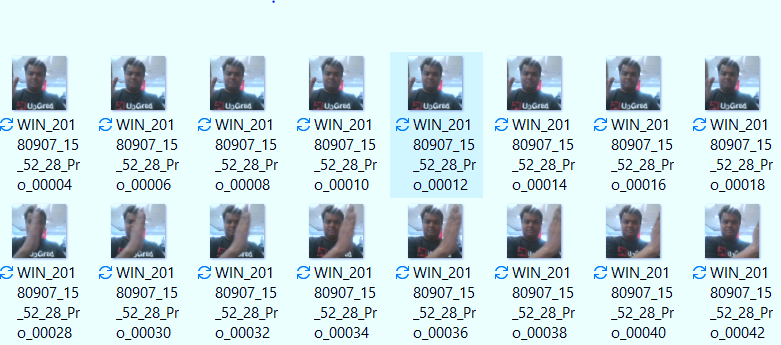

# Gesture Recognition

## Problem Statement
Imagine you are working as a data scientist at a home electronics company which manufactures state of the art smart televisions. You want to develop a cool feature in the smart-TV that can recognise five different gestures performed by the user which will help users control the TV without using a remote.

The gestures are continuously monitored by the webcam mounted on the TV. Each gesture corresponds to a specific command:

| Gesture | Corresponding Action |
| --- | --- | 
| Thumbs Up | Increase the volume. |
| Thumbs Down | Decrease the volume. |
| Left Swipe | 'Jump' backwards 10 seconds. |
| Right Swipe | 'Jump' forward 10 seconds. |
| Stop | Pause the movie. |

Each video is a sequence of 30 frames (or images).

## Objective
Develop a Model that is able to classify different Gesture with good accuracy.

## Dataset
You can download the dataset from [here.](https://drive.google.com/uc?id=1ehyrYBQ5rbQQe6yL4XbLWe3FMvuVUGiL)
The training data consists of a few hundred videos categorised into one of the five classes. Each video (typically 2-3 seconds long) is divided into a sequence of 30 frames(images). These videos have been recorded by various people performing one of the five gestures in front of a webcam - similar to what the smart TV will use.It looks like this:

## Model Building Approach
### 3D Convolutions Architecture
3D convolutions applies a 3 dimentional filter to the dataset and the filter moves 3-direction (x, y, z) to calcuate the low level feature representations. Their output shape is a 3 dimentional volume space such as cube or cuboid. They are helpful in event detection in videos, 3D medical images etc. They are not limited to 3d space but can also be applied to 2d space inputs such as images.

### CNN - RNN Architecture
The conv2D network will extract a feature vector for each image, and a sequence of these feature vectors is then fed to an RNN-based network. The output of the RNN is a regular softmax.

